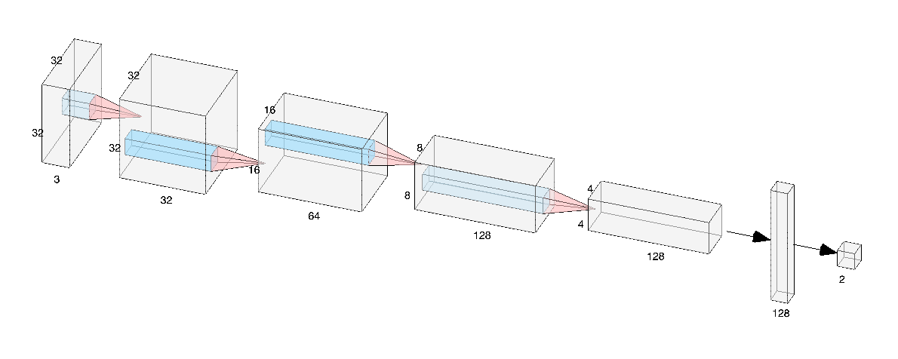
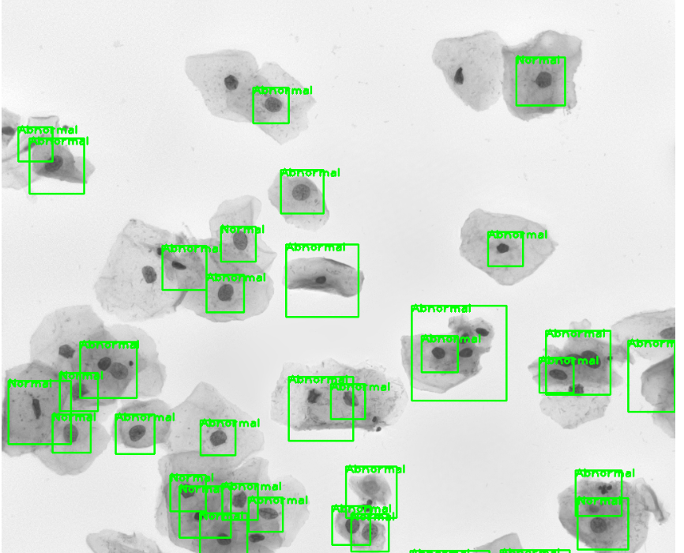

# DeepLearning_pap_smear

## 1. Overview
**Background**: Pap smears are a method of screening for abnormal cervical cells. However, these tests are difficult to analyze as there are multiple cells per pap smear. This results in a long waiting period of 1-3 weeks for test results. 

**Goal**:  To reduce the processing time of finding abnormal cervical cells in an automatic process, while keeping high accuracy on classification.

**Approach**:  We divided this task into two phases: segmentation and classification. To be specific, we trained and tuned a *deep neural network* to perform a *segmentation* on whole slide images to crop single cell images out of it. Then we fed these images into another deep neural network to *classify* the cells into 5 classes.

**Datasets**
* [Kaggle_Nuclei_for_Split_Trainging](https://www.kaggle.com/c/data-science-bowl-2018/)

* [SIPaKMeD_for_classfiying_Training](https://www.cs.uoi.gr/~marina/sipakmed.html)

* [Cervical_Cytology_Image_Segmentation_Challenge](https://cs.adelaide.edu.au/~carneiro/isbi14_challenge/dataset.html)

**Expected outcomes**: The proposed pipeline should accurately classify the cell into 5 different classes for each individual cells in the image of overlapped cervical cells.
## 2. Method
### 2.1 Cell Segmentation Methods
The neural network should be able to extract multi-scale contextual information while keeping high resolution. There are two methods:
1) using downsampling for multi-scale information and then upsampling for resolution reconstruction (eg: U-Net[2], FusionNet[4])
2) using dilated convolution, which supports exponential expansion of the receptive field without loss of resolution[3].

We divided the [Kaggle Nuclei Dataset](https://www.kaggle.com/c/data-science-bowl-2018/)[7] into training and validating parts with the ratio of 4:1 and trained classic *U-Net, FusionNet* and *Dilated ConvNet* on that with tuned hyperparameters (i.e. epochs, learning rate, batch size).  We then chose the model with highest validation accuracy and IoU (which is  U-Net). Then we applied it on [Overlapping Cervical Cytology Image Dataset](https://cs.adelaide.edu.au/~carneiro/isbi14_challenge/dataset.html)[8] and cropped out cells according to positions of  cells’ nuclei through blob detection. Finally, we piped these cell images to the classification part.

### 2.2 Cell Classification Methods
#### 2.2.1 Different DNN Models
In the second step, we focused on classification of individual cells into 5 different classes in the [Sipakmed Dataset](https://www.cs.uoi.gr/~marina/sipakmed.html)[9]. We split this dataset into a balanced dataset with 2592 images for the training, 809 for the validation and 648 images to evaluate test accuracy. For our initial models, we utilized data augmentation techniques including gray scaling and random horizontal flipping. The *baseline* consisted of two convolutional layers with batch norms and a dropout probability of 0.05. We also tried a couple of other models including a *truncated wide resnet50*, utilizing only the first two layers of the resnet, and a pretrained *Alexnet* and *Resnet 18*.

#### 2.2.2 Model Simplification
|        Baseline Model         |       Simplified Model       |
|:-----------------------------:|:----------------------------:|
| 14 Convolutional layers (7x7) | 6 Convolutional layers (3x3) |
|      Batch normalization      |     Batch normalization      |
|          Max-pooling          |         Max-pooling          |
|               /               |        Dropout layers        |

In addition to accuracy, we also wanted to explore whether or not a **simpler model** could perform nearly as well. As a baseline, we settled for an accuracy of approximately 85%, a bit lower than what we were able to achieve with ResNet. The baseline model we used consisted of 14 convolutional layers with 7x7 filters, 3 max pooling layers, and 1 average pooling layer. It contains a total of 202,754 neurons, and each convolutional layer contains 49C2 parameters where C represents the number of channels.

## 3. Result
|    Model     |  Training Dataset   | Training Time |  Loss  |  IoU   |
|:------------:|:-------------------:|:-------------:|:------:|:------:|
|    U-Net     | Nuclei--Kaggle 2018 |     75min     | 0.0783 | 0.8464 |
|  FusionNet   | Nuclei--Kaggle 2018 |    125min     | 0.0807 | 0.8456 |
| Dialeted CNN | Nuclei--Kaggle 2018 |    375min     | 0.1437 | 0.7938 |
* **Table1: Cell Segmentation Part Experiment Results**
---
| Architecture | Accuracy |
|:------------:|:--------:|
|   Baseline   |  78.4%   |
| Wide Resnet  |  45.8%   |
|   Alexnet    |  76.8%   |
|    Resnet    |  92.4%   |
* **Table2: Basic Pretrained Classification Results**
---
|            Ablation Study Feature            | Accuracy |
|:--------------------------------------------:|:--------:|
|               3x3 Conv Filters               |   90%    |
|                Dropout layers                |   88%    |
| Truncated model with 3x3 filters and dropout |   85%    |
* **Table3: Ablation Study Feature**
---
* **Result Picture**

## 4. Discussion
### 4.1 Cell Segmentation Discussion
In the cell segmentation part, we focused on **metrics of training time, losses and IoU** to evaluate our models. Unet has the best performance in all three metrics. 
FusionNet has deeper residual blocks and needs more epochs in the training process, which consumes time. However, the Nuclei dataset has only about 200 images, ¼ of them are used in the validation process. The advantage of the FusionNet’s deeper depth is not fully used for such a small training dataset. The structure of DilatedCNN is relatively simple and has fewer parameters. More epochs are needed for training and the process is time-consuming. However, its loss and IoU metrics are not good enough after 150 epochs of training. So DilatedCNN is not a suitable model for this task.

For the result of cell segmentation, the nucleus instead of the whole cell has been detected with some noise. The reason might be the limited size of training dataset and different attributes between training cells and pap smear cells.

### 4.2 Cell Classification Discussion
For the cell classification task,in ablation studies, we prove that with the addition of a few other key features (i.e. 3x3 conv filters, dropout layers, truncated model with 3x3 filters and dropout), the size of this model can be drastically reduced while still achieving accurate results. The first step to this analysis is by determining which layers of the original baseline model are most crucial.

As with each model, the different convolutional layers contribute differently to the overall accuracy of the model and since there is no exact science to choosing which layers are the most important and which layers could be taken out without much impact on the accuracy, there are a lot of experiments to go through before choosing which layers to get rid of. From here the number of layers is cut back from 14 convolutional layers to 6 convolutional layers in one of our simplified models and 7 convolutional layers in the other simplified model.

**Comvolutional Kernel:** To simplify the model, one important change is replacing the 7x7 convolutional filters with 3x3 filters, similar to what was done by Simonyan and Zisserman [1]. This reduces the number of parameters by approximately 82% because the 3x3 filter only requires 49C2 parameters. Although this decreases the effective receptive field, the accuracy does not suffer greatly and in fact performs better than our baseline accuracy

**Dropout:** nother popular feature related to regularization that helps prevent overfitting is dropout. For this ablation study, after each convolutional layer, we added a dropout layer with a probability of 50%. As a result, the dropout layers add a few percentage points of accuracy.

With the two aforementioned features, we can now truncate the model in the hopes of being able to simplify it. For this model, we decided to remove half of the convolutional layers while keeping all the pooling layers. With this combination, this truncated model contains 215,170 neurons, which is similar to the baseline model, but needs to only learn 49C2 parameters for each convolutional layer.

## 5. References
1. S. Karen & Z. Andrew. (2014). Very Deep Convolutional Networks for Large-Scale Image Recognition. ArXiv 1409.1556. 

2. O. Ronneberger, P. Fischer, and T. Brox. U-net: Convolutional networks for biomedical image segmentation. In MICCAI, pages 234–241. Springer, 2015. 2, 3

3. Yu, Fisher and Koltun, Vladlen. Multi-scale context aggregation by dilated convolutions. In ICLR, 2016. 

4. T. M. Quan, D. G. C. Hildebrand, and W.-K. Jeong. (2016). FusionNet: A deep fully residual convolutional neural network for image segmentation in connectomics. ArXiv 1612.05360

5. M. Huang. (2019). CellSegmentation. GitHub repository. https://github.com/marshuang80/CellSegmentation
 
6. J. Olafenwa (2018). Basics of Image Classification with Pytorch. https://heartbeat.fritz.ai/basics-of-image-classification-with-pytorch-2f8973c51864
